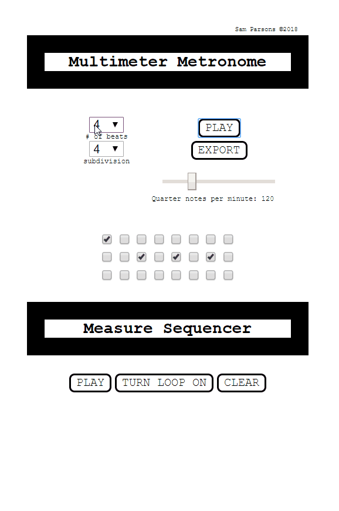

# Multimeter Metronome with Sequencing

Multimeter metronome built in React using Tone.js with sequencing features created as a tool for advanced musicians tackling contemporary repertoire.

View live in-progress [demo here](https://sam-parsons.github.io/react-tone-js-metronome)

## Built With
* React (create-react-app)
* Tone.js

## Future Features
- Step Sequence Visualization
- Idiomatic formatting of triple meters
- Preventing the tempo slider callback from executing on every value increment when the user slides

## Author
* **Sam Parsons** - *Initial work*

## License
This project is licensed under the MIT License - see the LICENSE.md file for details

## Acknowledgments
- Miguel Tepale - for having a conversation with me about a multi-functional metronome
- Ted Lorts - suggested I do this project in React

